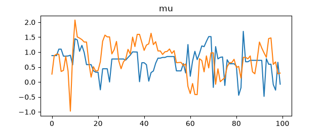
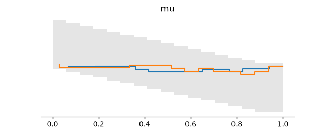
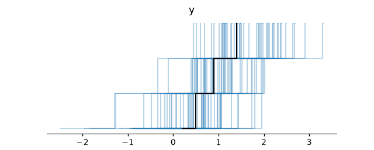

# Bayesite full-stack smoke

*2026-06-22T20:43:11Z by Showboat 0.6.1*
<!-- showboat-id: 712751c3-1187-4734-bcaf-6f52099d2553 -->

This executable smoke test exercises the full local stack: bayeswire model authoring through bayescycle, Bayesite sampling and diagnostics, bayesite-idata export to ArviZ NetCDF, bayesite-viz plots, and Showboat documentation. It writes generated artifacts under examples/_showboat_work. A small sibling helper script (`examples/full-stack-smoke-lib.sh`) centralizes path setup and tool wrappers so each executable block can stay focused on one workflow phase.

```bash
. examples/full-stack-smoke-lib.sh
reset_workdir
ensure_bayesite
uv --quiet run bayescycle --version
printf 'bayesite: %s\n' "$(basename "$BAYESITE_BIN")"
uv --quiet run bayescycle idata --help | sed -n '1p'
uv --quiet run bayescycle plot --help | sed -n '1p'

```

```output
bayescycle 0.1.0
bayesite: bayesite
usage: bayescycle idata [-h] [-o OUTPUT] [--validate {require,warn,skip}]
usage: bayescycle plot [-h] [-o OUTPUT] [--fit FIT_PATH] [--kind KIND]
```

Start with a real bayeswire model.py. The observed variable is vector-valued so posterior-predictive and PPC plots have a non-scalar observed dimension. The Dim metadata lets bayescycle write dims.json for downstream ArviZ coordinates.

```bash
. examples/full-stack-smoke-lib.sh
cat > "$WORK/model.py" <<'PY'
from bayeswire import Dim, Observed, Param, model
from bayeswire.distributions import Normal

obs = Dim("obs", coords=["a", "b", "c", "d"])


@model
class SmokeNormal:
    mu = Param(Normal(0.0, 1.0))
    y = Observed(Normal(mu, 1.0), dims=(obs,))
PY
cat > "$WORK/data.json" <<'JSON'
{"y": [0.2, 0.5, 0.9, 1.4]}
JSON
find "$WORK" -maxdepth 1 \( -name '*.json' -o -name 'model.py' \) -exec basename {} \; | sort

```

```output
data.json
model.py
```

Next bayescycle executes model.py, asks bayeswire for canonical IR, prepares the run directory, and invokes the Bayesite engine for posterior sampling.

```bash
. examples/full-stack-smoke-lib.sh
ensure_bayesite
uv --quiet run bayescycle sample \
  "$WORK/model.py" \
  --data "$WORK/data.json" \
  -o "$RUN" \
  --engine "$BAYESITE_BIN" \
  --seed 7 \
  --chains 2 \
  --warmup 100 \
  --draws 100
find "$RUN" -maxdepth 1 -type f -exec basename {} \; | sort
python3 - <<'PY'
import json
from pathlib import Path
run = Path("examples/_showboat_work/run")
ir = json.loads((run / "model.ir.json").read_text())
dims = json.loads((run / "dims.json").read_text())
header = json.loads((run / "posterior.ndjson").read_text().splitlines()[0])
print("ir:", ir["bayeswire_ir"])
print("dims:", dims["dims_format"], dims["dims"]["y"], dims["coords"]["obs"])
print("draws:", header["draws_format"], "chains", header["chain_count"], "draws", header["draw_count"])
print("parameters:", ", ".join(header["parameter_order"]))
PY

```

```output
data.json
dims.json
model.ir.json
posterior.ndjson
ir: 1
dims: bayescycle-dims-v1 ['obs'] ['a', 'b', 'c', 'd']
draws: v0-provisional chains 2 draws 200
parameters: mu
```

Bayesite owns sampler diagnostics. Ask bayescycle to run Bayesite diagnose on the run directory and print a compact chain/rhat/ESS summary.

```bash
. examples/full-stack-smoke-lib.sh
ensure_bayesite
uv --quiet run bayescycle diagnose "$RUN" --engine "$BAYESITE_BIN"
python3 - <<'PY'
import json
from pathlib import Path

d = json.loads(Path("examples/_showboat_work/run/diagnostics.json").read_text())
print("diagnostics:", d["diagnostics_format"])
print("chains:", d["source_chain_count"], "draws:", d["source_draw_count"])
print("mu rhat:", round(d["rhat"]["mu"], 3), "ess:", round(d["ess"]["mu"], 1))
for chain in d["chains"]:
    print(
        f"chain {chain['chain']}: divergences={chain['divergences']} "
        f"mean_accept={chain['mean_accept']:.3f} "
        f"tree_bins={chain['treedepth_histogram'][:3]}"
    )
PY

```

```output
diagnostics: v0-provisional
chains: 2 draws: 200
mu rhat: 1.009 ess: 49.1
chain 0: divergences=0 mean_accept=0.642 tree_bins=[0, 89, 11]
chain 1: divergences=0 mean_accept=0.912 tree_bins=[0, 76, 24]
```

For a model-checking plot, generate posterior predictive replicated y values from the same Bayesite fit stream.

```bash
. examples/full-stack-smoke-lib.sh
ensure_bayesite
uv --quiet run bayescycle posterior-predictive "$RUN" \
  --seed 8 \
  --engine "$BAYESITE_BIN"
python3 - <<'PY'
import json
from pathlib import Path
header = json.loads(Path("examples/_showboat_work/run/posterior_predictive.ndjson").read_text().splitlines()[0])
print("posterior_predictive:", header["posterior_predictive_format"])
print("draws:", header["draw_count"], "sites:", ", ".join(header["site_order"]))
print("site shape:", header["sites"][0]["shape"])
PY

```

```output
posterior_predictive: v0-provisional
draws: 200 sites: y
site shape: [4]
```

Now use `bayescycle idata` to convert the Bayesite run directory to an ArviZ NetCDF/DataTree file. It threads the same resolved Bayesite engine through to bayesite-idata's own `bayesite diagnose` validation, and defaults the export to `RUN_DIR/fit.nc`. The exporter also consumes the dims.json sidecar, so the observed y coordinate is named obs instead of an auto-generated dimension.

```bash
. examples/full-stack-smoke-lib.sh
ensure_bayesite
bayescycle_idata "$RUN" --validate require --engine "$BAYESITE_BIN" >/dev/null
relpath "$RUN/fit.nc"
python_with_viz - <<'PY'
import xarray as xr

dt = xr.open_datatree("examples/_showboat_work/run/fit.nc")
print("groups:", ", ".join(sorted(group.lstrip("/") or "/" for group in dt.groups)))
print("posterior.mu dims:", dt["/posterior"].ds["mu"].dims)
print("observed_data.y dims:", dt["/observed_data"].ds["y"].dims)
print("obs coords:", dt["/observed_data"].ds["obs"].values.tolist())
print("sample_stats:", ", ".join(sorted(dt["/sample_stats"].ds.data_vars)))
PY

```

```output
examples/_showboat_work/run/fit.nc
groups: /, observed_data, posterior, posterior_predictive, sample_stats
posterior.mu dims: ('chain', 'draw')
observed_data.y dims: ('obs',)
obs coords: ['a', 'b', 'c', 'd']
sample_stats: acceptance_rate, diverging, energy, tree_depth
```

Finally render agent-friendly ArviZ plots through `bayescycle plot`. It finds `RUN_DIR/fit.nc` automatically (already exported above, so no auto re-export happens here); pass `-o` for a deterministic path and `png_summary` normalizes it for recording output.

```bash
. examples/full-stack-smoke-lib.sh
for verb in trace rank ppc; do
  bayescycle_plot "$verb" "$RUN" -o "$WORK/${verb}.png" >/dev/null
  png_summary "$verb" "$WORK/${verb}.png"
done

```

```output
trace: examples/_showboat_work/trace.png png=ok
rank: examples/_showboat_work/rank.png png=ok
ppc: examples/_showboat_work/ppc.png png=ok
```

The trace and rank plots summarize chain behavior visually; the PPC plot checks replicated y draws against observed y.

```bash {image}

```



```bash {image}

```



```bash {image}

```


